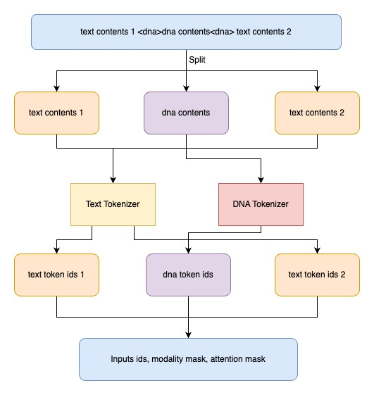
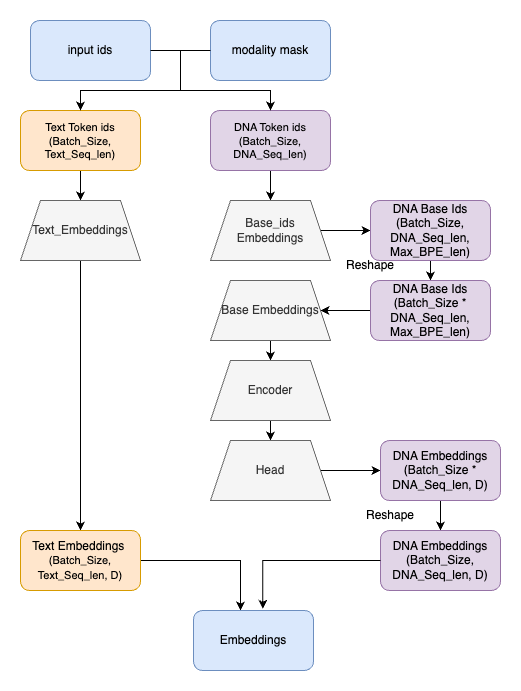
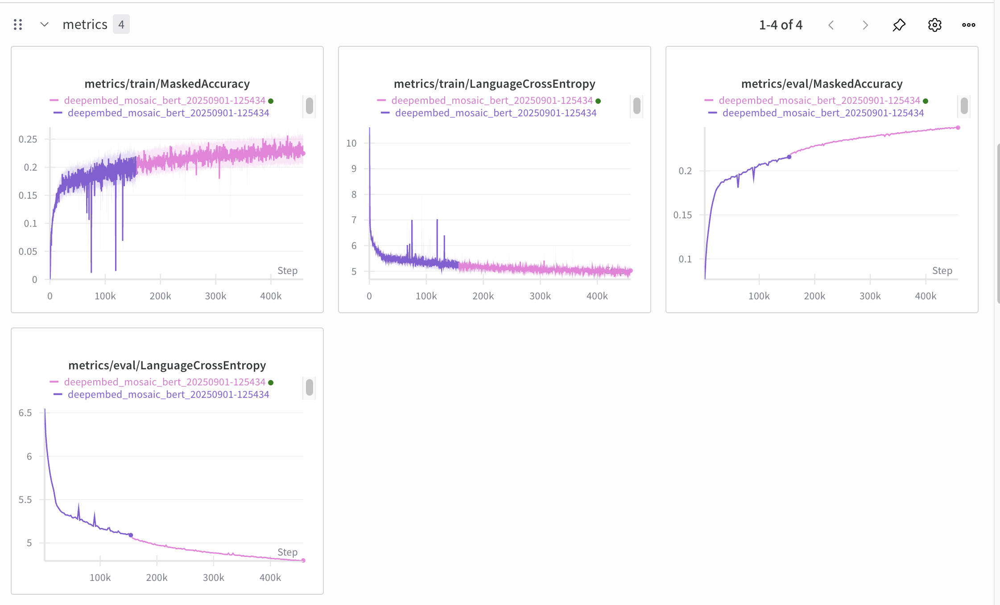

# DeepEmbed DNABERT

## Contents

This folder includes:

### Model Architecture

* **`src/DNATextTokenizers.py`** – Defines the `DNATextUnifiedTokenizer`, which tokenizes strings using both a text tokenizer (MosaicML-BERT) and a DNA tokenizer (initially DNABERT2).
* **`src/dna_text_biembedder.py`** – Implements the `DNATextBiEmbedding` class, which embeds token IDs produced by the `DNATextUnifiedTokenizer`. Text tokens are embedded using MosaicML-BERT embeddings, while DNA tokens are embedded with a lightweight transformer from basewise representations.
* **`src/bert_layers.py`** - Extends HuggingFace’s BERT to support **hybrid DNA + text embeddings**. It introduces two new classes:
    1. **`DeepEmbed_DNABertModel`** – a backbone BERT encoder that accepts DNA/text mixed input via `DNATextBiEmbedding`.
    2. **`DeepEmbed_DNABertForMaskedLM`** – a masked language modeling head adapted for DNA + text sequences.


### Convert Dataset
* **`src/convert_dataset_dnabert2.py`** – using DNATextUnifiedTokenizer to convert DNABERT2 pretrain data to mds format.
* **`src/convert_dataset_dnabert2_lmdb.py`** – using DNATextUnifiedTokenizer to convert DNABERT2 pretrain data to lmdb format.


---

## Script Details

### `src/DNATextTokenizers.py`

* **`DNATextUnifiedTokenizer` class**
  DNA sequences are marked in a sentence using the special `<dna>` tag.
  Example input:

  ```
    BRCA1 plays a key role in DNA repair: <dna>ATCGGCTAAGCT</dna> mutation here can increase cancer risk.
  ```

* **Output**
  The tokenizer returns a dictionary:

  ```python
  {
      "input_ids": torch.tensor([input_ids], dtype=torch.long),
      "modality_mask": torch.tensor([modality_mask], dtype=torch.long),
      "attention_mask": torch.tensor([attention_mask], dtype=torch.long),
  }
  ```

  * **`input_ids`**: text tokens are mapped to MosaicML-BERT IDs; DNA tokens are mapped to DNA tokenizer IDs with an added `dna_offset` (usually equal to the text tokenizer vocab size).
  * **`modality_mask`**: list of booleans, where 1 indicates a DNA token and 0 indicates a text token.
  * **`attention_mask`**: defaults to 1 for all tokens.

* **Usage**
  Run:

  ```bash
  python src/DNATextTokenizers.py
  ```

  This builds and saves a `DNATextUnifiedTokenizer` at `./saved_models/tokenizer_ckpt`.
  You can change the save directory or the underlying tokenizers by editing a few lines in `src/DNATextTokenizers.py`.



### `src/dna_text_biembedder.py`

This script implements the DNA-aware embedding module that combines text and DNA representations into a unified embedding space. It provides configuration, attention blocks, BPE-to-base mapping, a basewise transformer embedder, and a bi-modal embedding class.

---

#### **1. `DNABertConfig`**

* Extends `BertConfig` from HuggingFace with DNA-specific parameters.
* Key arguments:

  * `dna_vocab_size`: size of the DNA BPE vocabulary.
  * `dna_base_vocab_size`: number of base tokens.
  * `dna_base_dim`: embedding dimension for base tokens.
  * `max_dna_bpe_len`: maximum number of bases per DNA BPE token.
  * `dna_n_heads`, `dna_n_layers`: transformer dimensions for DNA embedding.
  * `dna_pad_token_id`: padding index for DNA.
  * `dna_position_embedding`: `"ALiBi"` or `"RoPE"`.
  * `trainable_dna_bpe2base`: whether BPE-to-base mapping is trainable.
  * `dna_offset`: ID offset separating text vs. DNA tokens.
  * `dna_pooling`: pooling method (`mean`, `first`, `last`).
  * `init_dna_base_ids`: path to initial base IDs tensor.

---

#### **2. Attention Blocks**

* **`AlibiAttentionBlock`**: Implements ALiBi (Attention with Linear Biases) for DNA sequences. Scales attention scores with distance-aware slopes.
* **`RoPEAttentionBlock`**: Implements rotary positional embeddings for DNA sequences (applied to `q` and `k` before attention).

Both modules take `(B*T, L, D)` inputs and output contextualized embeddings with positional bias.

---

#### **3. `BPE2BaseIDMapper`**

* Maps each BPE token to a sequence of base IDs.
* `Embedding` layer stores `(token_vocab_size, max_bpe_len)` mapping.
* Can load initialized base IDs (`init_base_ids`) or be filled with padding IDs.
* If `trainable=True`, the mapping is updated during training.
* Forward input: `(B, T)` BPE token IDs → output `(B, T, L)` base IDs.

---

#### **4. `BasewiseTransformerEmbedder`**

* Converts BPE tokens into base-level embeddings using a small transformer.
* Steps:

  1. **BPE2Base Mapping** → expand each BPE token into base IDs.
  2. **Base Embedding** → project each base into `base_dim`.
  3. **Transformer Blocks** (ALiBi or RoPE) → contextualize base embeddings.
  4. **Pooling** → aggregate base embeddings into a single token representation (`mean`, `first`, or `last`).
  5. **Projection** → final hidden dimension matches text embedding size.
* Forward input: `(B, T)` BPE IDs → output `(B, T, hidden_dim)` embeddings.
* Also provides:

  * `load_base_embeddings(base_embeddings)` to load custom base embeddings.
  * `from_checkpoint(path)` to restore from a saved state dict.

---

#### **5. `DNATextBiEmbedding`**

* Combines **text embeddings** and **DNA embeddings** into a unified representation.
* Workflow:

  * Initializes a text embedding matrix for token IDs `< dna_offset`.
  * Identifies DNA tokens (`input_ids >= dna_offset`).
  * For text positions → embed with `word_embeddings`.
  * For DNA positions → pass through `BasewiseTransformerEmbedder`.
  * Combine both via masking.
  * Apply `LayerNorm` and dropout.
* Forward input: `(B, T)` token IDs → output `(B, T, H)` unified embeddings.
* `use_dna_embedder=False` disables DNA embedding and uses only text embeddings.

---

#### **6. Utility Functions**

* **`apply_rope(q, k, seq_dim=2)`**: Applies rotary positional encoding.
* **`get_sin_cos(seq_len, dim, device)`**: Generates sinusoidal position encodings.
* **`rotate_half(x)`**: Helper for RoPE (rotates pairs of channels).
* **`build_init_base_ids(bpe_tokenizer, base_tokenizer, max_bpe_len, base_pad_id)`**:

  * Builds an `(bpe_vocab_size, max_bpe_len)` tensor mapping BPE tokens → base IDs.
  * Truncates or pads base IDs to `max_bpe_len`.
* **`compute_max_bpe_len(bpe_tokenizer, base_tokenizer)`**: Computes the maximum number of base tokens for any BPE token (used to set `max_dna_bpe_len`).

---

#### **7. Script Usage**

Run the script to build initial BPE→base mappings:

```bash
python src/dna_text_biembedder.py \
  --tokenizer_name zhihan1996/DNABERT-2-117M \
  --base_tokenizer_path ./saved_models/base_tokenizer \
  --save_path ./saved_models/dna2base_embeddings
```

This will:

1. Load the BPE tokenizer and base tokenizer.
2. Compute the maximum BPE length (`max_dna_bpe_len`).
3. Build initial base ID mappings.
4. Save to `init_base_ids.pth` under `--save_path`.




## How to Use

1. **Build DNA → Base Embeddings**
   Run the script to generate initial base-level mappings for DNA tokens:

   ```bash
   bash scripts/build_DNA2base_embe.sh
   ```

   This will save `init_base_ids.pth` into your `./saved_models/dna2base_embeddings` directory.

2. **Train the DeepEmbed-DNABERT Model**
   Launch training with MosaicML Composer using the provided YAML config:

   ```bash
   composer main.py yamls/main/deepembed-mosaic-bert-base-uncased-a100.yaml
   ```

   * The YAML file specifies model architecture, dataset paths, and training hyperparameters.
   * Check logs and saved checkpoints under the configured output directory.

